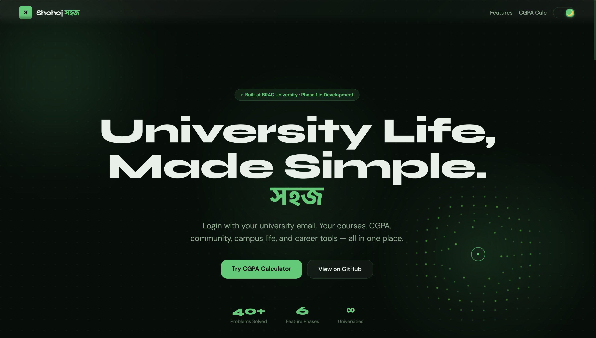
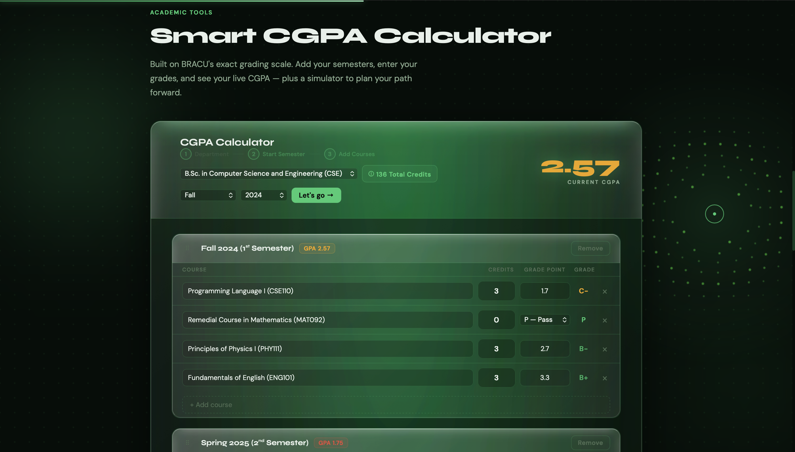
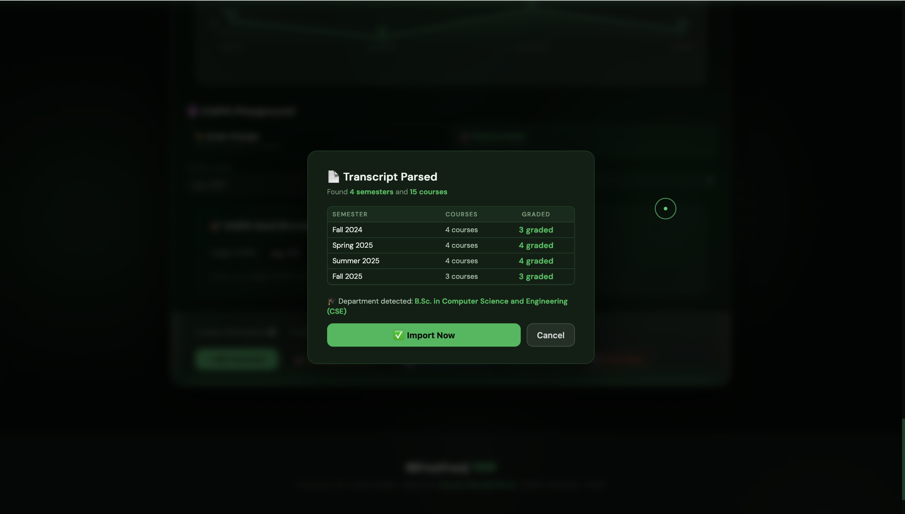
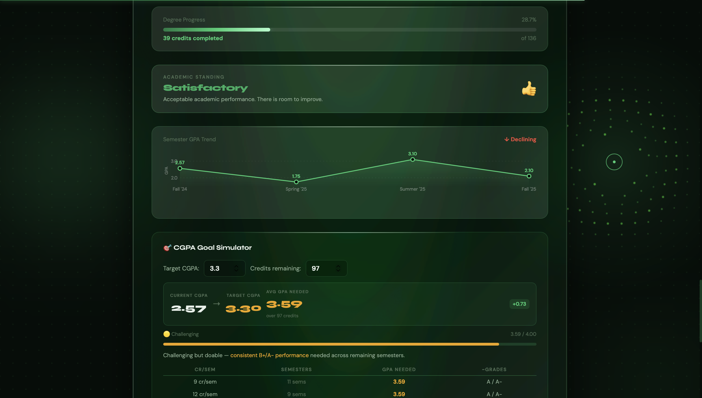
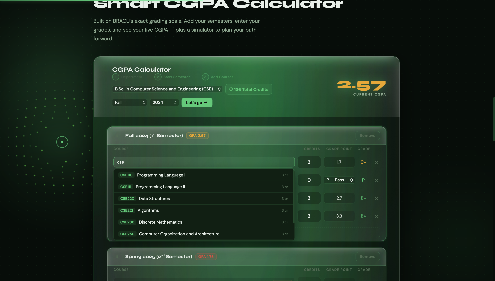
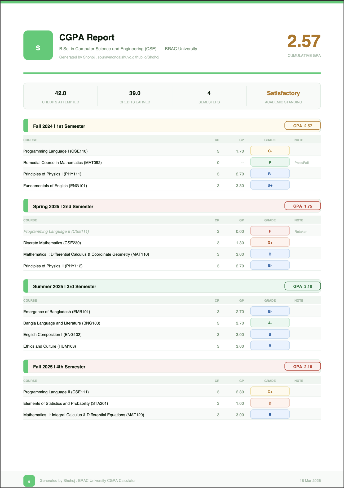

<p align="center">
  
</p>

<h1 align="center">সহজ — Shohoj</h1>
<p align="center"><strong>University life, made simple.</strong></p>

<p align="center">
  <a href="https://souravmondalshuvo.github.io/Shohoj">
    
  </a>
</p>

<p align="center">
  
  
  
  
  
</p>

---

<p align="center">
  
</p>

---

## What is Shohoj?

**Shohoj (সহজ)** means _"simple"_ in Bengali.

It is a university life platform built by a BRAC University student, for every university student in Bangladesh. One login. One place. Your entire university life.

Shohoj starts with the tool every student needs most — a **smart CGPA calculator** that understands BRACU's exact grading system, reads your official transcript PDF, and helps you plan your path to graduation.

> **[Try it live →](https://souravmondalshuvo.github.io/Shohoj)**

---

## Why This Exists

I am **Sourav Mondal Shuvo**, a CSE undergraduate at BRAC University.

Every semester I watched students — including myself — struggle with the same problems. Manual GPA calculations on phone calculators. No idea how retakes affect CGPA. Going into advising week with no plan. Important information buried in Facebook groups and word of mouth.

Nobody was building a solution. So I decided to build it myself.

---

## Features — What's Live Today

### 🎓 Smart CGPA Calculator

Full semester-based GPA and CGPA calculation using BRACU's exact grading scale. Supports all grade types — A through F, F(NT) (no transfer), Pass/Fail, and Incomplete. Handles retake detection automatically with both **best-grade** policy (students starting Spring 2024 or earlier) and **latest-grade** policy (Fall 2024 onwards).

<p align="center">
  
</p>

### 📄 Transcript PDF Import

Upload your official BRACU grade sheet PDF and Shohoj reads it automatically — every semester, every course, every grade. The parser handles multi-line course titles, zero-credit remedial courses, and auto-detects your department. No manual data entry required.

<p align="center">
  
</p>

### 🔮 What-If Simulator

Toggle hypothetical grades on any course and watch your CGPA update in real time. Plan retakes, set targets, and see exactly what it takes to reach your goal — before you commit.

<p align="center">
  
</p>

### 📊 GPA Trend Chart

A visual timeline of your GPA across semesters. Spot patterns, track improvement, and see your academic journey at a glance.

<p align="center">
  
</p>

### 🔍 Course Autocomplete

Start typing a course code or name and get instant suggestions from a complete BRACU course catalog. Credits auto-fill when you pick a course. Covers all 8 departments.

<p align="center">
  
</p>

### 📥 PDF Export

Export a professionally designed grade report — color-coded grade badges, per-semester GPA breakdown, academic stats, and a clean white-and-green layout ready for print or sharing.

<p align="center">
  
</p>

### ⚠️ Credit Load Warnings

Automatic alerts when your semester credit load falls below the 9-credit minimum, exceeds the 15-credit maximum, or enters the 13–15 range that requires chairman's permission.

### 🏛️ 8 Department Presets

Pre-built semester templates for **CSE, EEE, BBA, Economics, English, Architecture, Pharmacy, and Law**. Select your department and get a ready-made course plan to start from.

### 🌓 Dark & Light Theme

Full dark and light mode with smooth transitions, persisted across sessions.

---

## Design & Experience

Shohoj is built to feel like a real product, not a student project.

- **Liquid glass UI** — glassmorphism panels with layered depth and shine
- **Animated dot matrix background** — spring-physics canvas with mouse-reactive particles
- **Custom cursor system** — animated dot + ring + glow with hover/click states, fully delegated for dynamic elements
- **Scroll reveal animations** — IntersectionObserver-powered entrance effects with staggered timing
- **Responsive layout** — works on desktop and mobile

<p align="center">
  
</p>

---

## Supported Departments

| Department                          | Code | Status          |
| ----------------------------------- | ---- | --------------- |
| Computer Science & Engineering      | CSE  | 🟢 Full support |
| Electrical & Electronic Engineering | EEE  | 🟢 Full support |
| Business Administration             | BBA  | 🟢 Full support |
| Economics                           | ECO  | 🟢 Full support |
| English                             | ENG  | 🟢 Full support |
| Architecture                        | ARC  | 🟢 Full support |
| Pharmacy                            | PHR  | 🟢 Full support |
| Law                                 | LLB  | 🟢 Full support |

---

## Tech Stack

| Layer      | Technology                                            | Purpose                                                |
| ---------- | ----------------------------------------------------- | ------------------------------------------------------ |
| Frontend   | HTML, CSS, Vanilla JavaScript                         | Zero-dependency, fast, portable                        |
| PDF Import | [pdf.js](https://mozilla.github.io/pdf.js/) v3.11.174 | Reading BRACU transcript PDFs                          |
| PDF Export | [jsPDF](https://github.com/parallax/jsPDF) v2.5.1     | Generating grade report PDFs                           |
| Build      | Python (`build3.py`)                                  | Bundles all modules into a single deployable HTML file |
| Hosting    | GitHub Pages                                          | Free, fast, always available                           |

**Phase 2+** will migrate to React.js, Tailwind CSS, Firebase, and Vercel as the platform scales beyond academic tools.

---

## Roadmap

### Phase 1 — Academic Core _(Current)_

| Feature                             | Status                                       |
| ----------------------------------- | -------------------------------------------- |
| Smart GPA Calculator                | ✅ Complete                                  |
| CGPA What-If Simulator              | ✅ Complete                                  |
| GPA Trend Analysis                  | ✅ Complete _(originally Phase 6)_           |
| Transcript PDF Import               | ✅ Complete _(bonus — not in original plan)_ |
| PDF Grade Report Export             | ✅ Complete _(bonus — not in original plan)_ |
| Course Catalog & Autocomplete       | ✅ Complete _(bonus — not in original plan)_ |
| Credit Load Warnings                | ✅ Complete _(bonus — not in original plan)_ |
| Retake Impact Analyzer              | ✅ Complete                                  |
| Degree Progress Tracker             | 🔜 Planned                                   |
| Semester Planner with Prerequisites | 🔜 Planned                                   |
| Course Difficulty Map               | 🔜 Planned                                   |
| Advising Week Checklist             | 🔜 Planned                                   |
| Freshman Survival Guide             | 🔜 Planned                                   |

### Phase 2 — Community Layer

Course & faculty reviews, past papers & notes library, interview experience board, study group finder.

### Phase 3 — Campus Life

Interactive campus map, cafeteria guide, bus routes & timings, lost & found board.

### Phase 4 — Career & Opportunities

Internship listings, alumni directory, resume review board, company hiring history.

### Phase 5 — Marketplace

Secondhand textbook market, carpooling board, student discount directory.

### Phase 6 — Intelligence Layer

Smart semester recommendations, burnout warning system, graduation timeline predictor.

---

## Multi-University Vision

Shohoj is designed from Day 1 to scale beyond BRAC University. The architecture supports university-scoped data — a student logs in with their university email, and the system loads their university's entire ecosystem automatically.

| Stage | Scope                                  |
| ----- | -------------------------------------- |
| v1.0  | BRAC University                        |
| v2.0  | NSU, IUB, EWU                          |
| v3.0  | All private universities in Bangladesh |
| v4.0  | Public universities (BUET, DU, CUET)   |
| v5.0  | South Asia                             |

---

## Project Structure

```
Shohoj/
├── assets/
│   ├── shohoj-logo.png
│   └── screenshots/
│       ├── hero-preview.png
│       ├── calculator.png
│       ├── transcript-import.png
│       ├── what-if.png
│       ├── trend-chart.png
│       ├── autocomplete.png
│       ├── pdf-export.png
│       └── ui-polish.png
├── css/
│   └── style.css                 All styles — themes, animations, glassmorphism
├── js/
│   ├── main.js                   Entry point — wires all modules together
│   ├── core/
│   │   ├── grades.js             BRACU grading scale & grade detection
│   │   ├── helpers.js            Semester name generation, season/year utilities
│   │   ├── state.js              Shared state object, localStorage persistence
│   │   ├── departments.js        8 department definitions with preset semesters
│   │   ├── catalog.js            Full BRACU course database
│   │   └── calculator.js         GPA/CGPA engine, retake policy, credit warnings
│   ├── ui/
│   │   ├── render.js             Semester rendering, drag-drop reorder
│   │   ├── suggestions.js        Course autocomplete suggestion portal
│   │   ├── charts.js             Canvas GPA trend chart
│   │   ├── simulator.js          What-If mode logic & UI
│   │   └── modals.js             Transcript import modal, PDF export
│   ├── animations/
│   │   ├── cursor.js             Custom animated cursor with event delegation
│   │   ├── dotmatrix.js          Spring-physics dot matrix canvas background
│   │   └── reveal.js             IntersectionObserver scroll reveal system
│   └── import/
│       └── parser.js             BRACU transcript PDF parser (dual-strategy)
├── index.html                    Main HTML shell
├── README.md
├── LICENSE
└── build3.py                     Build script — bundles into single shohoj.html
```

---

## Getting Started

**Use it online:**
Visit **[souravmondalshuvo.github.io/Shohoj](https://souravmondalshuvo.github.io/Shohoj)** — no installation needed.

**Run locally:**

```bash
git clone https://github.com/souravmondalshuvo/Shohoj.git
cd Shohoj
```

Open `index.html` in your browser, or use a local server:

```bash
python3 -m http.server 8000
# Visit http://localhost:8000
```

**Build the bundled version:**

```bash
python3 build3.py
# Outputs shohoj.html — single file, ready to deploy
```

---

## Contributing

Shohoj is built for students, by students. Contributions are welcome.

### How to Contribute

1. **Fork** the repository
2. **Create a branch** for your feature or fix
   ```bash
   git checkout -b feature/your-feature-name
   ```
3. **Make your changes** — follow the existing code style (vanilla JS, no frameworks in Phase 1)
4. **Test** — open `index.html` locally, verify your changes work in both dark and light themes
5. **Build** — run `python3 build3.py` to regenerate the bundled file
6. **Submit a pull request** with a clear description of what you changed and why

### Ways to Help

- **Developers** — pick an open issue or build a planned feature from the roadmap
- **Designers** — improve UI/UX, suggest layout changes, create assets
- **BRACU Students** — test the transcript import with your own grade sheet, report bugs
- **Students from Other Universities** — help adapt Shohoj for your university's grading system
- **Campus Ambassadors** — spread the word at your university when Shohoj expands

### Code Guidelines

- Phase 1 is **vanilla HTML/CSS/JS** — no frameworks, no build tools beyond `build3.py`
- All cross-module calls use `window._shohoj_*` to avoid circular imports
- Functions called from HTML `onclick`/`onchange` are assigned to `window.*` in `main.js`
- Test in both **dark and light themes**
- Check that **jsPDF export** doesn't break — only ASCII characters in helvetica font strings

---

## Founder

<p align="center">
  <strong>Sourav Mondal Shuvo</strong><br/>
  CSE Undergraduate, BRAC University<br/><br/>
  <a href="https://www.linkedin.com/in/souravmondalshuvo/">LinkedIn</a> · 
  <a href="https://souravmondalshuvo.github.io/Portfolio">Portfolio</a> · 
  <a href="https://github.com/souravmondalshuvo">GitHub</a>
</p>

---

## License

MIT License — open for the student community.

See [LICENSE](LICENSE) for details.

---

<p align="center">
  <em>"University life, made simple."</em><br/>
  <strong>— Shohoj, সহজ</strong>
</p>
