<p align="center">
  
</p>

<h1 align="center">সহজ — Shohoj</h1>
<p align="center"><strong>University life, made simple.</strong></p>

<p align="center">
  <a href="https://souravmondalshuvo.github.io/Shohoj">
    
  </a>
</p>

<p align="center">
  
  
  
  
  
  
</p>

---

<p align="center">
  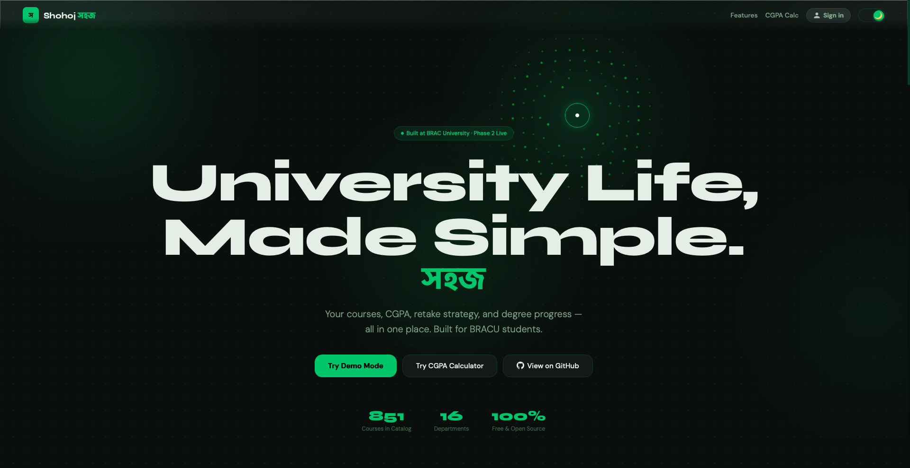
</p>

---

## Recruiter Demo Path

1. Open the [live site](https://souravmondalshuvo.github.io/Shohoj)
2. Click "Try Demo Mode"
3. Check CGPA Calculator
4. Open Semester Planner
5. View Degree Progress
6. Explore Faculty Reviews / Past Papers
7. Review Architecture, Security, and Deployment docs

## My Role

Solo developer. I built and maintain the frontend, the Firebase auth and
Firestore data model, the security rules, the Cloudflare Worker, the CI/CD
pipeline, the test suites, the documentation, and the product design.

## Current status

Shohoj is a live, single-maintainer project. An honest snapshot of what is
shipping versus in progress:

- **Two frontends coexist, on purpose.** The production app people use today is
  a vanilla-JS application bundled by `build3.py` into `shohoj.html`. A typed
  **React + TypeScript + React Router** rewrite lives alongside it under `src/`
  and is deployed to a beta path (`/app/`). The React shell has reached parity
  on most routes but is **not yet the default root** — the cutover is a
  deliberate, still-pending step (see [docs/architecture/](docs/architecture/)).
- **The in-app Assistant is gated on its backend.** The chat UI only appears
  when the Worker reports its Anthropic key is configured (`GET /ready`); until
  the key is set on the deployed Worker it is intentionally hidden rather than
  shown-and-broken.
- **Some features depend on external data feeds** (live seat status, free rooms)
  that are third-party and best-effort.
- **No claim of a user base.** This is a portfolio-grade project built for
  BRACU students; adoption numbers are not tracked or advertised.

See [Features — What's Live Today](#features--whats-live-today) and the [Roadmap](#roadmap) below for the per-feature breakdown.

---

## Documentation

| Doc | What's in it |
|-----|-------------|
| [docs/ARCHITECTURE.md](docs/ARCHITECTURE.md) | Tech stack, source layout, build pipeline, data flow |
| [docs/CASE_STUDY.md](docs/CASE_STUDY.md) | Problem, solution, engineering challenges, decisions, next steps |
| [docs/SECURITY.md](docs/SECURITY.md) | Authentication, authorization, App Check, threat model |
| [docs/PRIVACY.md](docs/PRIVACY.md) | What's collected, where it lives, how to delete it |
| [docs/DEPLOYMENT.md](docs/DEPLOYMENT.md) | Required secrets, CI/CD pipeline, local dev, Worker + Firestore deploy, admin claim |
| [docs/ROLLBACK.md](docs/ROLLBACK.md) | Per-system rollback: Pages, Worker, Firestore rules, and user data |
| [docs/ENVIRONMENTS.md](docs/ENVIRONMENTS.md) | Local / staging / production separation and configuration surface |
| [docs/OBSERVABILITY.md](docs/OBSERVABILITY.md) | The logging foundation that exists today, and future metrics |
| [docs/BACKUP_AND_RESTORE.md](docs/BACKUP_AND_RESTORE.md) | Firestore/R2 backup guidance, restore-into-staging, RPO/RTO |
| [docs/GITHUB_SECURITY_SETTINGS.md](docs/GITHUB_SECURITY_SETTINGS.md) | Admin checklist: private reporting, scanning, branch ruleset, env, secrets |
| [docs/DEMO_VIDEO_SCRIPT.md](docs/DEMO_VIDEO_SCRIPT.md) | Script + shot-by-shot storyboard for the 55-second walkthrough (video pending) |
| [CHANGELOG.md](CHANGELOG.md) | Version history and notable changes |
| [v0.3.0 release notes](docs/RELEASE_NOTES_v0.3.0.md) | Recruiter Demo Release summary and verification |

---

## Product Screenshots

| Demo Mode | Semester Planner |
|-----------|------------------|
| 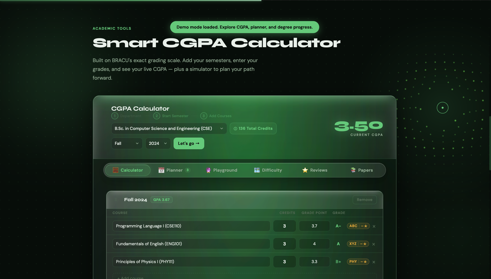 | 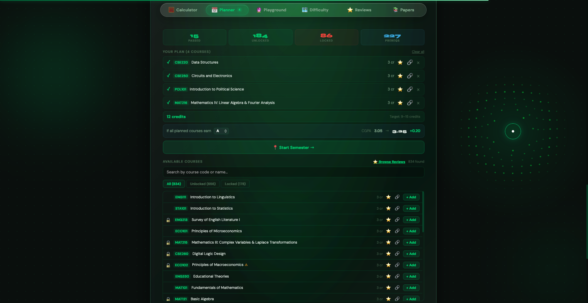 |

| Calculator | Transcript Import |
|------------|-------------------|
| 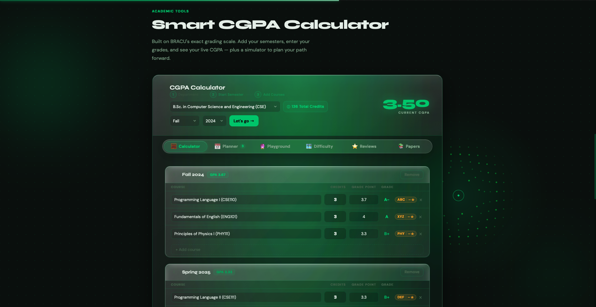 | 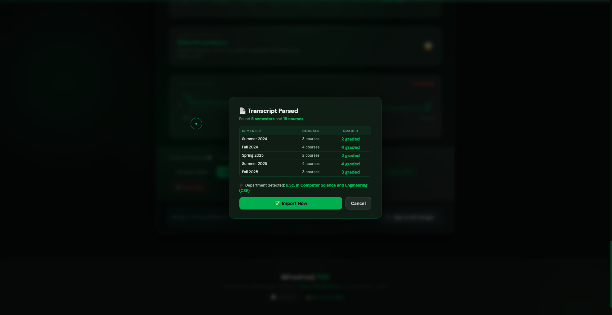 |

| Course Search | Trend Chart |
|---------------|-------------|
| 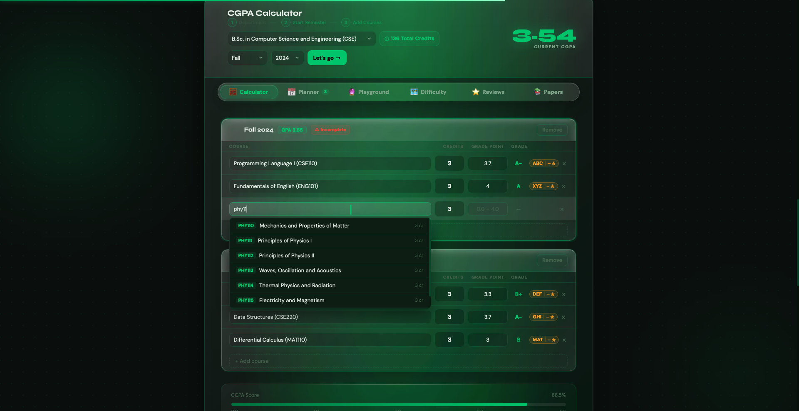 | 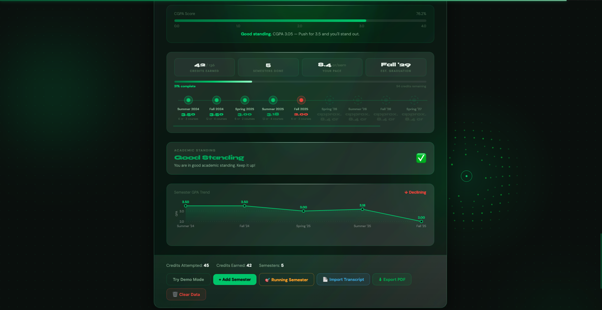 |

| Degree Progress | Faculty Reviews |
|-----------------|-----------------|
| 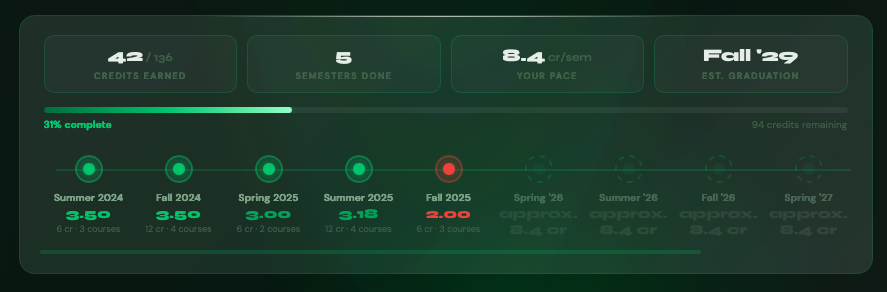 | 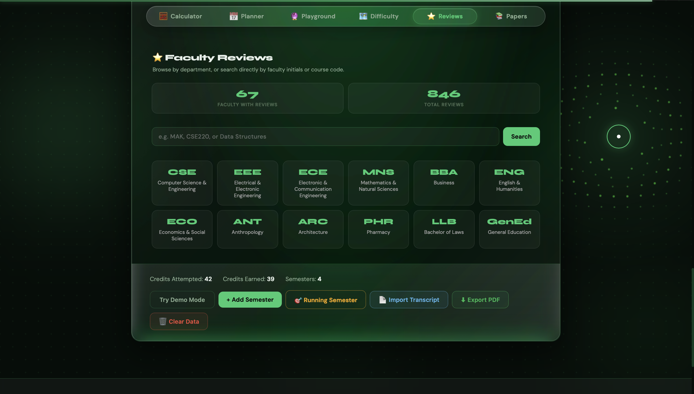 |

| Past Papers | Admin Dashboard |
|-------------|-----------------|
| 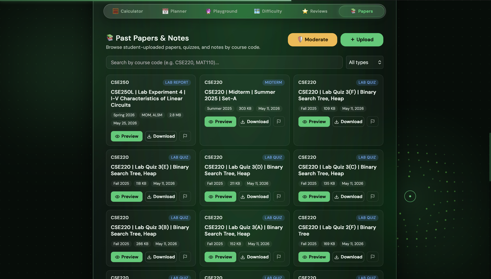 | 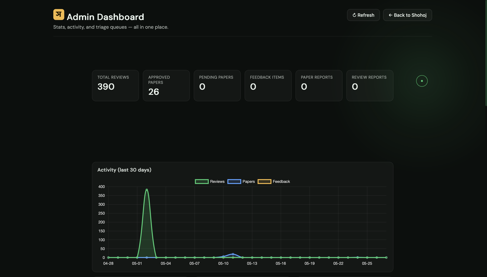 |

<p align="center">
  <strong>Mobile View</strong><br>
  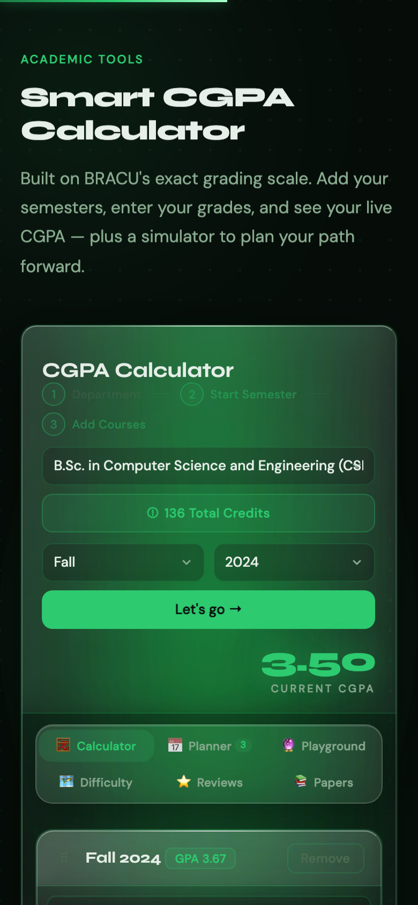
</p>

---

## What is Shohoj?

**Shohoj (সহজ)** means _"simple"_ in Bengali.

It is a university life platform built by a BRAC University student, for every university student in Bangladesh. One login. One place. Your entire university life.

Shohoj starts with the tool every student needs most — a **smart CGPA calculator** that understands BRACU's exact grading system, reads your official transcript PDF, syncs your data to the cloud, and helps you plan your path to graduation.

> **[Try it live →](https://souravmondalshuvo.github.io/Shohoj)**

---

## Why This Exists

I am **Sourav Mondal Shuvo**, a CSE undergraduate at BRAC University.

Every semester I watched students — including myself — struggle with the same problems. Manual GPA calculations on phone calculators. No idea how retakes affect CGPA. Going into advising week with no plan. Important information buried in Facebook groups and word of mouth.

Nobody was building a solution. So I decided to build it myself.

---

## Features — What's Live Today

### 🗓️ Routine Builder (New)

Build a clash-free weekly class schedule from the live BRACU section feed, then export or share it.

- **Auto-suggest** — generates valid section combinations for your chosen courses, ranked to prefer **compact days** (a `gapWeight` factor penalizes idle time between same-day classes); each suggestion shows its total gap time
- **Conflict detection** — overlapping sections are split and flagged in a weekly grid; faculty ratings surface inline on each section
- **Calendar export** — download an `.ics` with class + exam reminders, or share a scannable QR / link of your routine
- **Time-of-day & day-off filters** — narrow sections to your availability before building

### 🪑 Seat Status & Seat-Drop Alerts (New)

Live seat availability across every section, with a watchlist that tells you the moment a full section opens.

- **Live seat lookup** — capacity / consumed / room / schedule pulled from the public CONNECT feed (one cached fetch serves the whole app)
- **In-browser alerts** — watch a full section and get a browser notification + in-app toast when a seat frees up while Shohoj is open
- **Email alerts** — a cron-triggered Cloudflare Worker polls the feed centrally and emails you on a real full→open transition, even with Shohoj closed (requires an operator-configured verified email sender; fails safe and logs when unconfigured)

### 🏫 Free Rooms (New)

Find empty classrooms right now or across the week, computed from the live timetable.

- **All-rooms status board** — every room labelled free / in class / in lab, with its room type
- **Weekly availability** — click a room to see its full-week free/busy grid in a modal
- **Feed-aware** — derived purely from the scheduled timetable; no ad-hoc booking data is invented

### 👤 Profile (New)

A signed-in student's account hub — one home for data otherwise scattered across tabs. Gated on the existing Firebase auth; signed-out users see a sign-in prompt.

- **Account header** — name, BRACU email, safe avatar, sign out
- **Seat watchlist + email-alert toggle** — see what you're watching and arm/pause email alerts independently
- **Routine + planner snapshot** and **your reviews** — read locally; the reviews list uses a privacy-preserving local receipt so no UID-indexed query can de-anonymize a review
- **Hard non-goal** — Shohoj never collects or stores BRACU CONNECT credentials; there is no such field anywhere

### 📅 Semester Planner (New)

Plan your next semester with prerequisite-aware recommendations. Shohoj reads your completed courses and surfaces what you can take now, what is still locked behind missing prerequisites, and what will unlock the most downstream courses if you take it next.

- **Prerequisite checker** — validates every planned course against BRACU's prereq rules, flags hard-prereq misses as blockers and soft-prereq misses as warnings
- **Prereq tree view** — expandable dependency graph for any course, so you can see exactly what you need to clear before it
- **Relevance ranking** — available courses are sorted by department relevance, then by how many future courses they unlock
- **Credit load validation** — enforces the 9/12/15-credit BRACU policy and flags chairman-permission zones
- **CGPA impact preview** — see the projected CGPA if your plan lands a given grade across the board
- **Start Semester** — promote a finished plan directly into a running semester in the Calculator with one click

<p align="center">
  
</p>

### 🗺️ Course Difficulty Map (New)

A bird's-eye view of how hard each course actually is, based on real student reviews. Aggregates difficulty and workload ratings across the whole review corpus and surfaces them as a sortable, filterable card grid.

- **Aggregate scores** — every course shows mean difficulty and workload pulled from the live review corpus (minimum 3 reviews to appear)
- **Difficulty tags** — courses are auto-labelled Moderate / Challenging / Hard based on their score, with color-coded bars
- **Department filter** — pill-style toggles to narrow the grid to a single department or browse the full catalog
- **Sort by code, difficulty, or workload** — flip between alphabetical course code, hardest-first, or heaviest-workload-first ordering
- **One-click drill-down** — tapping a card jumps straight to the per-course review panel for that course

### ⭐ Faculty Reviews (New)

Pseudonymous faculty ratings from real BRACU students — stored in Firestore, gated behind BRACU G-Suite sign-in.

- **5-dimension ratings** — Teaching Quality, Marking Fairness, Behavior & Attitude, Course Difficulty, Workload
- **Pseudonymous to other users** — the review document body contains no user identifier. Each review's Firestore doc ID is derived from a deterministic SHA-256 hash of `uid + faculty + course`, so the same user's reviews for different courses don't share a visible hash
- **One immutable review per user per faculty-course pair** — deterministic doc IDs enforce one public review slot per user and pair. Once submitted, the client cannot edit or overwrite it; duplicate attempts are rejected and the existing review is shown read-only.
- **Per-course panel** — click the ⭐ on any planner course row to see aggregate ratings for every faculty who taught that course, plus sample review text
- **Reviews directory** — search by course code or faculty initials to browse the review corpus (paginated)
- **In-transcript rating** — rate your faculty directly from the course row in the Calculator tab, no separate flow
- **Report for moderation** — every review surfaces a "Report" action that writes to an admin-only `reviewReports` collection, capped at one report per user per review
- **LLM-assisted seeding** — the `scripts/seed_reviews.py` pipeline bulk-imports LLM-processed community posts so the directory isn't empty on day one

<p align="center">
  
</p>

#### Anonymity — what we do and don't claim

Review submissions go through the Cloudflare Worker (`POST /reviews`) before the Firestore document is written. That means:

- ✅ Your raw Firebase UID and email are **never** written into the review document.
- ✅ Reviews for different (faculty, course) pairs produce different hashes, so a third party who reads the collection **cannot trivially group all of your reviews together** by looking at a single field.
- ⚠️ Firebase **project administrators** (and anyone with admin SDK access) can audit Firestore logs and in principle correlate a write back to the authenticated session. "Anonymous to the public" ≠ "anonymous to the service operator."
- ⚠️ A determined adversary who already knows your UID could reconstruct your review hash for any (faculty, course) pair.

The Worker strips identity fields from the public review body before committing. Stronger operator-level anonymity would require a more advanced backend design with blind tokens or another unlinkable submission protocol.

### 📚 Past Papers & Notes (New)

BRACU-only resource sharing for course papers, notes, assignments, lab reports, and quizzes.

- **Course-code browsing** — search by catalog course code or browse recent approved uploads
- **Moderated uploads** — uploads start as `approved: false` and only become public after admin review
- **Secure file proxy** — file bodies live in Cloudflare R2 and are accessed only through a Firebase-token-verified Worker
- **Owner-scoped storage paths** — new uploads are stored under `papers/{COURSE}/{UPLOADER_UID}/{filename}`, and Firestore rules reject metadata that points at another user's upload path
- **Strict file allowlist** — uploads are capped at 10 MB and restricted to PDF, PNG, JPEG, WebP, or GIF
- **Report flow** — every paper can be reported once per user for admin review

<p align="center">
  
</p>

### 💬 Feedback Board (New)

In-app product feedback for bugs, feature ideas, and general comments.

- **BRACU-gated feedback** — only signed-in BRACU users can submit or view feedback
- **Anonymous option** — feedback can omit the public UID field while still being rules-gated by the authenticated session
- **Private upvote state** — upvote documents are readable only by the voter or admins, so the UI shows your own vote state rather than exposing global voter data
- **Admin cleanup** — admin-claim moderators can remove abusive or duplicate feedback

### 🧑‍🤝‍🧑 Study Group Finder (New)

Post a study group for a course, find classmates, and join open groups — all gated behind BRACU G-Suite sign-in.

- **Post & browse** — create a group with a course code, name, description, meeting mode (online / in-person / hybrid), schedule, capacity, and a group-chat invite link; browse and filter the board by course code or mode
- **Two-tier connect** — the contact link is the public connect path (visible to every BRACU user), while the member email roster is **member-only**: you join to see who's in, and to be seen, so emails stay opt-in
- **Join / leave** — one tap to join or leave; each membership doc pins your own verified BRACU email, so joining can never publish someone else's address
- **Immutable once posted** — group docs can't be edited after creation (no bait-and-switch on a joined roster); creators can delete their own group, admins can delete any
- **Report flow** — every group has a Report action writing to an admin-only `studyGroupReports` queue, capped at one report per user per group
- **Hard non-goal** — Shohoj never collects BRACU CONNECT credentials; the only contact field is a user-supplied public chat link

### 🛡️ Admin Dashboard (New)

A separate admin shell at `/admin/` for moderation and audit work.

- **Custom-claim access** — only Firebase users with `admin: true` can open the dashboard or perform admin actions
- **Moderation queues** — pending papers, paper reports, review reports, and feedback are handled in one place
- **Safe file deletion** — reported-paper deletion resolves the paper metadata first, then deletes both the R2 object and Firestore metadata
- **Audit logs** — admin actions are written to immutable `adminLogs` documents

<p align="center">
  
</p>

### ☁ Cloud Sync

Sign in with your BRACU G-Suite account (`@g.bracu.ac.bd`) and your data syncs automatically across all your devices via Firebase. Your CGPA, semesters, and grades are always with you — whether you're on your phone, laptop, or a friend's computer.

- **Google Sign-In** — custom modal with BRACU domain restriction, no browser dialogs
- **Automatic sync** — data saves to Firestore every time you make a change
- **Real-time updates** — if you edit on another device, this one reloads automatically
- **Offline support** — changes save locally and sync when you reconnect
- **Migration flow** — if you already have local data, a modal lets you choose which to keep
- **Data deletion** — delete your cloud data any time from the sign-out modal

### 🎓 Smart CGPA Calculator

Full semester-based GPA and CGPA calculation using BRACU's exact grading scale. Supports all grade types — A through F, F(NT) (no transfer), Pass/Fail, and Incomplete. Handles retake and repeat detection automatically with both **best-grade** policy (students starting Spring 2024 or earlier) and **latest-grade** policy (Fall 2024 onwards).

<p align="center">
  
</p>

### 📄 Transcript PDF Import

Upload your official BRACU grade sheet PDF and Shohoj reads it automatically — every semester, every course, every grade. The parser handles multi-line course titles, zero-credit remedial courses, and auto-detects your department. No manual data entry required.

<p align="center">
  
</p>

### 🔮 CGPA Playground

A dedicated panel with two powerful tools for planning your academic future:

**✏️ Grade Changer** — Pick any graded course, set a hypothetical new grade, and see the exact CGPA impact instantly. Stack multiple changes and see the cumulative effect. Each change shows its individual contribution to your CGPA shift.

**🎯 Reverse Solver** — _"What grade do I need in CSE220 to reach 3.0 CGPA?"_ — Enter your target CGPA, pick a course, and Shohoj tells you the minimum grade required. Shows whether it's achievable, impossible, or already reached. Every BRACU student asks this question — now there's a tool that answers it.

### 🎯 CGPA Goal Simulator

Set a target CGPA and see what average GPA you need across your remaining credits. Includes a difficulty assessment, credit-pace breakdown showing how many semesters it'll take at 9/12/15 credits per semester, and a Smart Retake & Repeat Strategy ranked by CGPA impact.

### 🔄 Smart Retake & Repeat Strategy

Select courses to retake or repeat and see exactly how your CGPA changes — individually per course and cumulatively. Each course is tagged with its improvement mechanism:

- **Retake** — for F grades. Re-enroll in the course for a full semester (allowed up to twice).
- **Repeat** — for grades below B (B- through D-). Sit a special exam once, within 2 semesters of the initial enrollment. No grade cap — the latest grade counts.

Both mechanisms follow the same intake-based CGPA policy (best grade for Spring 2024 and earlier intakes; latest grade for Fall 2024 onwards).

### 📊 GPA Trend Chart

A visual timeline of your GPA across semesters. Spot patterns, track improvement, and see your academic journey at a glance.

<p align="center">
  
</p>

### 🎓 Degree Progress Tracker

Visual timeline of your degree journey — credits earned vs total required, semester-by-semester progress nodes, estimated graduation date based on your current pace, and a running credit pace indicator.

<p align="center">
  
</p>

### 🔍 Course Autocomplete

Start typing a course code or name and get instant suggestions from a complete BRACU course catalog with **857 courses** across all **16 departments**. Credits auto-fill when you pick a course.

<p align="center">
  
</p>

### 📥 PDF Export

Export a professionally designed grade report — color-coded grade badges, per-semester GPA breakdown, academic stats, and a clean white-and-green layout ready for print or sharing.

<p align="center">
  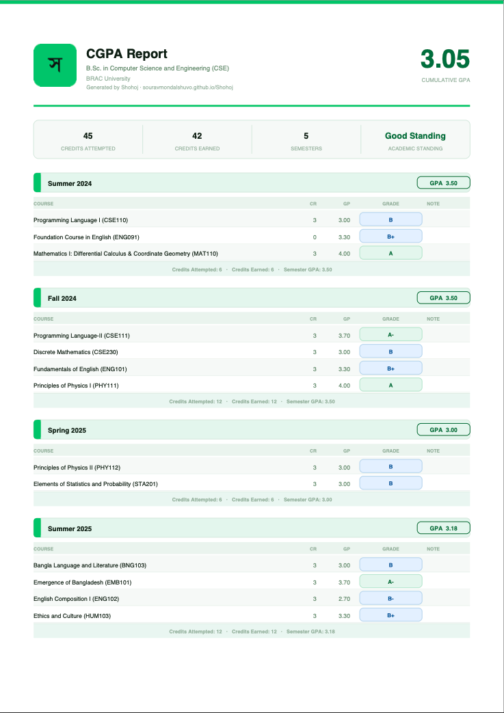
</p>

<p align="center">
  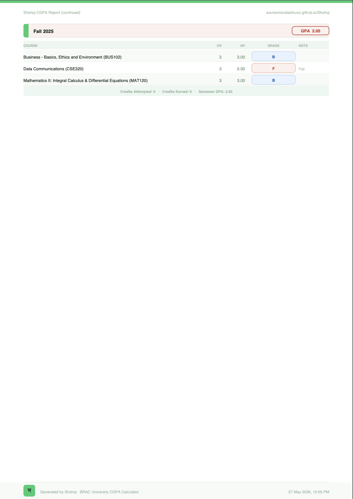
</p>

### ⚠️ Credit Load Warnings

Automatic alerts when your semester credit load falls below the 9-credit minimum, exceeds the 15-credit maximum, or enters the 13–15 range that requires chairman's permission.

### 🏅 Academic Standing

Live indicator showing your current academic standing based on BRACU policy — from Perfect Standing (4.0) and Higher Distinction (≥3.65) down to Academic Probation (<2.0). Updates instantly as you enter grades.

### 🎯 Running Semester (Projected CGPA)

Add a "running" semester for your current in-progress courses. See projected CGPA before final grades come in — without affecting your earned credits or official CGPA.

### ↕️ Drag-to-Reorder Semesters

Drag and drop semester blocks to reorder them. Useful if you imported a transcript and want to rearrange the layout.

### 🏛️ 16 Department Presets

Pre-built semester templates for **CSE, CS, ECE, EEE, BBA, Economics, English, Anthropology, Physics, Applied Physics & Electronics, Mathematics, Microbiology, Biotechnology, Architecture, Pharmacy, and Law**. Select your department and get a ready-made course plan to start from. Includes bi/tri-semester support — Pharmacy runs Spring+Summer, Law runs Spring+Fall, all others run all three semesters.

### 🌓 Dark & Light Theme

Full dark and light mode with smooth transitions, persisted across sessions.

---

## Design & Experience

Shohoj is built to feel like a real product, not a student project.

- **Liquid glass UI** — glassmorphism panels with layered depth and shine
- **Animated dot matrix background** — spring-physics canvas with mouse-reactive particles
- **Custom cursor system** — animated dot + ring + glow with hover/click states, circle-to-I-beam morphing with spring easing
- **Scroll reveal animations** — IntersectionObserver-powered entrance effects with staggered timing
- **Responsive layout** — works on desktop and mobile with 6 breakpoints (480px → 1920px)

---

## Supported Departments

| Department                          | Code | Credits | Semesters  | Status          |
| ----------------------------------- | ---- | ------- | ---------- | --------------- |
| Computer Science & Engineering      | CSE  | 136     | Tri        | 🟢 Full support |
| Computer Science                    | CS   | 124     | Tri        | 🟢 Full support |
| Electronic & Communication Eng.     | ECE  | 136     | Tri        | 🟢 Full support |
| Electrical & Electronic Engineering | EEE  | 136     | Tri        | 🟢 Full support |
| Business Administration             | BBA  | 130     | Tri        | 🟢 Full support |
| Economics                           | ECO  | 120     | Tri        | 🟢 Full support |
| English                             | ENG  | 120     | Tri        | 🟢 Full support |
| Anthropology                        | ANT  | 120     | Tri        | 🟢 Full support |
| Physics                             | PHY  | 132     | Tri        | 🟢 Full support |
| Applied Physics & Electronics       | APE  | 130     | Tri        | 🟢 Full support |
| Mathematics                         | MAT  | 127     | Tri        | 🟢 Full support |
| Microbiology                        | MIC  | 136     | Tri        | 🟢 Full support |
| Biotechnology                       | BIO  | 136     | Tri        | 🟢 Full support |
| Architecture                        | ARC  | 207     | Tri        | 🟢 Full support |
| Pharmacy                            | PHR  | 164     | Bi (Sp+Su) | 🟢 Full support |
| Law                                 | LLB  | 135     | Bi (Sp+Fa) | 🟢 Full support |

**Total: 857 courses in catalog** (including GED/common courses shared across departments)

---

## Tech Stack

| Layer       | Technology                                            | Purpose                                                |
| ----------- | ----------------------------------------------------- | ------------------------------------------------------ |
| Shipping frontend | HTML, CSS, vanilla JavaScript (bundled by `build3.py`) | The production app people use today (`shohoj.html`)    |
| Beta frontend | TypeScript, React 19, React Router, Vite            | The typed rewrite under `src/`, deployed to `/app/` (not yet the default root) |
| Validation  | [Zod](https://zod.dev/)                               | Runtime schema validation for imported/restored data   |
| Auth & Sync | Firebase Auth + Firestore (Spark plan)                | Google Sign-In, cloud data sync, real-time updates     |
| PDF Import  | [pdf.js](https://mozilla.github.io/pdf.js/)           | Reading BRACU transcript PDFs                           |
| PDF Export  | [jsPDF](https://github.com/parallax/jsPDF)            | Generating grade report PDFs                            |
| Charts      | [Chart.js](https://www.chartjs.org/)                  | Admin dashboard and analytics visualizations           |
| Files/API   | Cloudflare Worker + R2                                | Auth-gated past-paper upload/download/delete, server-mediated review writes, and the Assistant relay |
| Assistant   | Anthropic Claude (Haiku) via the Worker               | In-app assistant; the key lives only on the Worker, never in the client |
| Build       | Python (`build3.py`) + Vite                           | `build3.py` bundles the shipping app; Vite builds the React shell/pages |
| Hosting     | GitHub Pages                                          | Static hosting for both the shipping app and the `/app/` beta |
| Testing     | Node.js test runner + Playwright + `@firebase/rules-unit-testing` | Unit tests (app logic + Worker), browser E2E, and Firestore rules tests against the emulator |
| CI / CD     | GitHub Actions + GitHub Pages                         | One pipeline: full validation on every PR/push; deploy only after it passes, on push to main |

CDN scripts in the shipping app are loaded with **SRI integrity hashes** (`sha384-...` / `sha512-...`) to prevent supply-chain tampering; the React shell bundles its dependencies through Vite instead.

**Deployment pipeline:** a single workflow (`.github/workflows/ci.yml`) runs the full validation suite (lint, format check, typecheck, data validation, unit + Firestore rules tests, worker tests, build + E2E + bundle/CSP guards) on every pull request and push. The deploy jobs `needs:` all of it and run **only on push to `main`**, so a red suite blocks production deployment. Firestore rules/index deploys **fail closed** — if the rules changed but the deploy credentials are missing, the job errors rather than reporting a green deploy over stale production rules. The frontend deploys to the `gh-pages` branch (served by GitHub Pages), publishes a `version.json` build stamp, and runs a post-deploy smoke test; the Worker deploy runs its own `/health` + `/ready` smoke check. See [docs/DEPLOYMENT.md](docs/DEPLOYMENT.md) and [docs/ROLLBACK.md](docs/ROLLBACK.md).

> **Note on multi-service deploys.** The frontend, the Worker, and the Firestore
> rules deploy as three independent, path-filtered jobs — this is **not** an
> atomic multi-service release. A push that touches all three can land them at
> slightly different times; each has its own post-deploy check and rollback path.

> **Static analysis / secret scanning** (CodeQL / GitHub code scanning, secret
> scanning, push protection, Dependabot alerts) are **repository settings**, not
> workflow files in this repo, so their status cannot be asserted from the code.
> Dependency review runs as a workflow (`dependency-review.yml`). See
> [docs/GITHUB_SECURITY_SETTINGS.md](docs/GITHUB_SECURITY_SETTINGS.md) for the
> exact enablement checklist.

**On the two frontends:** the vanilla `js/` app is still what `build3.py` bundles
and ships, so production stays stable while the typed rewrite is validated. The
React shell (`src/`) — a parity-tested typed domain core, feature slices, and a
React Router shell — has migrated most routes and is deployed to `/app/`, but is
**not yet the default root**. See [docs/architecture/](docs/architecture/) for the
migration roadmap, target architecture, and decision records.

### Architecture at a glance

```
Browser
  │
  │ loads runtime-config.js (Firebase web config, generated from secrets)
  ▼
GitHub Pages — bundled HTML/CSS/JS (shohoj.html, admin.html, profile.html)
  │
  │ Firebase Auth (BRACU @g.bracu.ac.bd sign-in)
  │ App Check (reCAPTCHA v3)
  ▼
Firestore (rules-enforced for browser clients)
  ├── users/{uid}            — semesters, grades, settings
  ├── facultyReviews/{hash}  — pseudonymous, append-only reviews
  ├── reviewReports/{...}    — moderation queue (admin-read)
  ├── papers/{paperId}       — past-paper metadata
  ├── paperReports/{...}     — paper moderation queue
  ├── appFeedback/{id}       — feedback board
  ├── appFeedbackUpvotes/{feedbackId_uid}
  │                          — private per-user upvote state
  ├── facultyProfiles/{init} — admin-seeded faculty directory
  ├── studyGroups/{groupId}  — study group finder posts (immutable)
  ├── studyGroupMembers/{groupId_uid}
  │                          — member-only roster (own email pinned)
  ├── studyGroupReports/{uid_groupId}
  │                          — study group moderation queue (admin-read)
  └── adminLogs/{id}         — admin action audit trail

Cloudflare Worker (auth-proxy, BRACU email + admin claim)
  ├── POST /reviews — service-account review writes
  └── R2 — past-paper PDFs and raster images

Firebase custom claim `admin: true`
  ├── set out-of-band via scripts/set_admin_claim.js
  ├── read by Firestore rules
  └── read by the Worker for delete authorization
```

For a deeper breakdown see [docs/ARCHITECTURE.md](docs/ARCHITECTURE.md); for what to set up to deploy, see [docs/DEPLOYMENT.md](docs/DEPLOYMENT.md).

---

## Security

Shohoj has been through a self-directed security review (no external audit is claimed), and the following protections are in place across the codebase. For the precise threat model — including what is **not** covered — see [docs/SECURITY.md](docs/SECURITY.md):

- **XSS prevention** — all user-sourced strings (course names, semester labels, PDF-imported data, error messages) are escaped via `escHtml()` and `escAttr()` helpers in `helpers.js` before any `innerHTML` insertion.
- **Safe transcript import** — `applyImport()` no longer serialises parsed PDF data into an `onclick` attribute. Parsed data is held in a JS-side `_pendingImport` slot and consumed directly, eliminating attribute-injection risk.
- **localStorage sanitisation** — `sanitizeRestoredState()` validates and strips malformed or legacy data on every load, including stripping legacy `<sup>` HTML from semester names.
- **CDN subresource integrity** — `jsPDF`, `pdf.js`, and `Chart.js` are loaded with `integrity` and `crossorigin="anonymous"` attributes.
- **BRACU domain restriction** — Google Sign-In is restricted to `@g.bracu.ac.bd` accounts only, enforced both client-side after the popup and server-side via Firestore security rules.
- **Firestore security rules** — users can only read and write their own document (`users/{uid}`), and only if their token email matches `.*@g\.bracu\.ac\.bd`. Faculty reviews (`facultyReviews/{reviewId}`) are readable by BRACU accounts but client creates/updates are denied; new reviews are written through the Worker (`POST /reviews`) with deterministic IDs and a public body that stores no UID or email. Only admin-claim moderators can delete abusive reviews. Review reports (`reviewReports/{uid_reviewId}`) are write-only from the client, must point at a real review, and are capped at one report per user per review. Paper metadata is created only by the Worker, then readable only when approved, owned by the uploader, or accessed by an admin. Feedback upvote documents are readable only by their owner or an admin. Study groups (`studyGroups/{groupId}`) are readable by BRACU accounts, created only with the caller's own `creatorUid`, immutable after creation, and deletable only by the creator or an admin; membership docs (`studyGroupMembers/{groupId_uid}`) pin the joiner's own verified email and are readable only by the member, a fellow member of the same group, or an admin, so the email roster never leaks to non-members. `facultyProfiles` is read-only for all clients; only admin-side seed scripts can write to it. No other access is permitted.
- **Past-paper file controls** — the Cloudflare Worker verifies Firebase ID tokens, rejects non-BRACU users, stores new uploads under `papers/{COURSE}/{UPLOADER_UID}/{filename}`, allows legacy downloads/deletes for older files, caps uploads at 10 MB, and accepts only PDF, PNG, JPEG, WebP, or GIF.
- **Pseudonymous faculty reviews** — the public review document body stores no UID, email, or other user identifier. The Firestore doc ID is a deterministic, **unsalted** SHA-256 of `uid | faculty | course` (there is no secret salt — the determinism is what enforces one review per user/faculty/course). This is pseudonymity to other users, **not** anonymity: a project admin can correlate writes, and anyone who already knows a UID can reproduce the hash. Full detail in [docs/SECURITY.md](docs/SECURITY.md).
- **Firebase config exposure** — the Firebase web config is public by design. Shohoj keeps it out of committed source by generating `js/config/runtime-config.js` from local `.env` values or GitHub Actions secrets at build time (the generated file is gitignored). Access is protected by Firestore rules (and App Check once console enforcement is verified — see [docs/SECURITY.md](docs/SECURITY.md)), not by hiding the web config.

---

## Roadmap

### Phase 1 — Academic Core _(Complete)_

| Feature                             | Status      |
| ----------------------------------- | ----------- |
| Smart GPA Calculator                | ✅ Complete |
| CGPA Playground (Grade Changer)     | ✅ Complete |
| CGPA Playground (Reverse Solver)    | ✅ Complete |
| CGPA Goal Simulator                 | ✅ Complete |
| GPA Trend Analysis                  | ✅ Complete |
| Transcript PDF Import               | ✅ Complete |
| PDF Grade Report Export             | ✅ Complete |
| Course Catalog & Autocomplete       | ✅ Complete |
| Credit Load Warnings                | ✅ Complete |
| Retake & Repeat Strategy Analyzer   | ✅ Complete |
| Degree Progress Tracker             | ✅ Complete |
| Security audit & XSS hardening      | ✅ Complete |
| Cloud Sync (Firebase Auth)          | ✅ Complete |
| Test suite & CI                     | ✅ Complete |
| Semester Planner with Prerequisites | ✅ Complete |
| Faculty Reviews (anonymous, 5-dim)  | ✅ Complete |
| Course Difficulty Map               | ✅ Complete |

### Phase 2 — Community Layer _(Partially Live)_

| Feature                            | Status      |
| ---------------------------------- | ----------- |
| Review corpus growth               | 🔶 Ongoing  |
| Past Papers & Notes library        | ✅ Live     |
| Feedback board                     | ✅ Live     |
| Admin moderation dashboard         | ✅ Live     |
| Study group finder                 | ✅ Live     |

### Phase 3 — Campus Life

Interactive campus map, cafeteria guide, bus routes & timings, lost & found board.

### Phase 4 — Career & Opportunities

Internship listings, alumni directory, interview experience board, resume review board, company hiring history.

### Phase 5 — Marketplace

Secondhand textbook market, carpooling board, student discount directory.

### Phase 6 — Intelligence Layer

Smart semester recommendations, burnout warning system, graduation timeline predictor.

---

## Multi-University Vision

Shohoj is designed from Day 1 to scale beyond BRAC University. The architecture supports university-scoped data — a student logs in with their university email, and the system loads their university's entire ecosystem automatically.

| Stage | Scope                                  |
| ----- | -------------------------------------- |
| v1.0  | BRAC University                        |
| v2.0  | NSU, IUB, EWU                          |
| v3.0  | All private universities in Bangladesh |
| v4.0  | Public universities (BUET, DU, CUET)   |
| v5.0  | South Asia                             |

---

## Project Structure

```
Shohoj/
├── assets/
│   ├── shohoj-logo.png
│   └── screenshots/
├── admin/
│   └── index.html                Admin shell source
├── profile/
│   └── index.html                Profile account-hub shell source
├── css/
│   └── style.css                 All styles — themes, animations, glassmorphism, auth UI
├── data/
│   ├── faculty_profiles.jsonl    Seed faculty directory injected by build3.py
│   └── input_reviews.jsonl       Seed faculty reviews injected by build3.py
├── js/
│   ├── admin-entry.js            Entry point for the admin bundle
│   ├── main.js                   Entry point — wires all modules together
│   ├── auth/
│   │   ├── firebase-init.js      Firebase SDK imports, config, App Check, Auth, Firestore
│   │   ├── firebase.js           Auth orchestration, Firestore sync, admin/paper hooks
│   │   ├── auth-service.js       Auth UI helpers and avatar safety checks
│   │   ├── user-sync-service.js  Stored-state parsing and sync fingerprint helpers
│   │   ├── review-service.js     Review identity window hooks
│   │   ├── paper-service.js      Papers Worker URL and ID token helpers
│   │   └── admin-service.js      Admin access window hooks
│   ├── config/
│   │   ├── runtime-config.template.js
│   │   └── runtime-config.js     Generated locally/CI, gitignored
│   ├── core/
│   │   ├── grades.js             BRACU grading scale & grade detection
│   │   ├── helpers.js            Semester utilities, escHtml/escAttr, sanitizers
│   │   ├── state.js              Shared state object, localStorage persistence
│   │   ├── departments.js        16 department definitions with preset semesters
│   │   ├── catalog.js            Full BRACU course database (857 courses)
│   │   ├── calculator.js         GPA/CGPA engine, retake/repeat policy, credit warnings
│   │   ├── dispatch.js           Delegated UI action registry
│   │   ├── faculty.js            Faculty directory cache, initials normalization
│   │   ├── papers.js             Past-paper validation and storage hooks
│   │   ├── reviews.js            Review submission & fetch layer, aggregation helpers
│   │   └── studyGroups.js        Study group validation + Firestore hook wrappers
│   ├── ui/
│   │   ├── render.js             Semester rendering, drag-drop reorder, faculty input
│   │   ├── suggestions.js        Course autocomplete suggestion portal
│   │   ├── charts.js             Canvas GPA trend chart
│   │   ├── simulator.js          CGPA Goal Simulator & Smart Retake & Repeat Strategy
│   │   ├── playground.js         CGPA Playground — Grade Changer & Reverse Solver
│   │   ├── planner.js            Semester Planner — prereq checks, plan builder, tree view
│   │   ├── reviews.js            Review modal, per-course panel, reviews directory
│   │   ├── reviewsTab.js         Reviews tab — directory browse, faculty/course search
│   │   ├── difficultyMap.js      Course Difficulty Map — aggregated difficulty + workload by course
│   │   ├── papersTab.js          Past Papers & Notes browse/upload/report UI
│   │   ├── previewModal.js       Shared paper preview modal
│   │   ├── feedback.js           Feedback modal and board
│   │   ├── groupsTab.js          Study Group Finder — post/browse/join/report, member roster
│   │   ├── adminDashboard.js     Admin moderation dashboard
│   │   ├── tracker.js            Degree Progress Tracker with timeline
│   │   └── modals.js             Transcript import modal, PDF export
│   ├── animations/
│   │   ├── cursor.js             Custom animated cursor with event delegation
│   │   ├── dotmatrix.js          Spring-physics dot matrix canvas background
│   │   └── reveal.js             IntersectionObserver scroll reveal system
│   └── import/
│       └── parser.js             BRACU transcript PDF parser (dual-strategy)
├── scripts/
│   ├── generate_runtime_config.js Generate local runtime-config.js
│   ├── rename_faculty_initials.py  Faculty seed-data maintenance helper
│   ├── seed_faculty.py           Bulk-import faculty profiles into Firestore
│   ├── seed_reviews.py           Bulk-import LLM-processed faculty reviews into Firestore
│   └── set_admin_claim.js        Grant/revoke Firebase admin custom claim
├── worker/
│   ├── index.js                  Cloudflare Worker for R2 paper files
│   ├── test/worker.test.js       Worker validation tests
│   └── wrangler.toml             Worker deploy config
├── firestore.rules               Firestore security rules
├── firestore.indexes.json        Required Firestore composite indexes
├── firebase.json                 Firestore emulator config
├── tests/                        Node test-runner unit suites (see the CI badge for pass status). Representative:
│   ├── calculator.test.js        GPA engine, retake/repeat policies, grade detection
│   ├── parser.test.js            department detection, semester parsing, blob parser
│   ├── planner.test.js           prereq resolution, plan validation
│   ├── reviews.test.js           review submission, aggregation, faculty grouping
│   ├── studyGroups.test.js       draft validation, mode/course checks, member summary
│   ├── routine*.test.js          routine state, suggestions, grid, faculty, export
│   ├── seatStatus/seatWatch      live seat lookup + watchlist persistence
│   ├── freeRooms.test.js         empty-room derivation from the timetable
│   ├── profileTab.test.js        account hub — header, watchlist, alert toggle
│   ├── typedCoreParity.test.js   src/ typed core parity vs the legacy js/ logic
│   └── firestore.rules.test.js   77 tests — emulator-driven security rules checks
├── e2e/                          Playwright E2E for the legacy bundled app + routine, seats, free rooms, profile
├── e2e-shell/                    Playwright E2E for the React Router shell routes (calculator, planner, reviews, seats, profile, campus life, a11y)
├── e2e-vite/                     Playwright E2E for the Vite island build
│                                 (45 spec files total across the three configs)
├── src/                          TypeScript/React migration — opt-in, NOT the default shipping UI
│   ├── core/                     Typed ports of domain logic (gpa, grades, catalog, reviews, planner, routine*, seats, rooms…), parity-tested vs js/ via tests/typedCoreParity.test.js
│   ├── features/calculator/      React calculator — semesters, course rows, summary, ARIA combobox autocomplete; shell bridge reads the real typed catalogue
│   ├── app/                      React Router shell — providers, routes, routing (hosts the migrated /calculator route)
│   ├── services/storage/         Versioned typed persistence (keyValueStore, migrate, backup, syncDecision) — not yet wired into the legacy path
│   ├── state/                    Theme + Notification providers (with pure theme.ts / notifications.ts)
│   ├── platform/                 Runtime config, feature flags, capabilities, logger
│   ├── react/                    Island entry points + CGPA summary/meter components
│   ├── firebase/firebase-entry.js  Firebase island entry point
│   └── shared/                   Shared UI (Button) and validation schema
├── docs/
│   └── architecture/             Migration roadmap, current state, target architecture, risk register, test matrix, ADRs
├── .github/
│   ├── workflows/
│   │   ├── ci.yml                One CI/CD pipeline: full validation, then gated deploy of frontend + Worker + Firestore on push to main
│   │   └── dependency-review.yml Blocks PRs adding vulnerable dependencies
│   └── dependabot.yml            Monthly grouped dependency-update policy
│                                 (CodeQL runs via GitHub's default setup, configured in the UI)
├── index.html                    Main HTML shell
├── playwright.config.js          Playwright config for the legacy bundled app E2E
├── playwright.shell.config.js    Playwright config for the React Router shell E2E
├── playwright.vite.config.js     Playwright config for the Vite island build E2E
├── vite.config.js                Vite multi-entry island build config
├── vite.shell.config.js          Vite config for the React Router shell
├── eslint.config.js              Flat ESLint config (correctness-only)
├── tsconfig.json                 Strict no-emit TypeScript check config
├── package.json                  Unit, rules, E2E, typecheck, build, and local config scripts
├── README.md
├── LICENSE
└── build3.py                     Build script — outputs shohoj.html, admin.html, and profile.html
```

---

## Getting Started

**Use it online:**
Visit **[souravmondalshuvo.github.io/Shohoj](https://souravmondalshuvo.github.io/Shohoj)** — no installation needed.

**Run locally:**

```bash
git clone https://github.com/souravmondalshuvo/Shohoj.git
cd Shohoj
```

Open `index.html` in your browser, or use a local server:

```bash
python3 -m http.server 8000
# Visit http://localhost:8000
```

**Run tests:**

```bash
npm test
# Runs app, Worker, and Firestore rules tests

npm run test:rules
# Runs only Firestore rules tests (requires Java 21+)
```

**Build the bundled version:**

```bash
python3 build3.py
# Outputs shohoj.html, admin.html, and profile.html — ready to deploy
```

> **Note:** You don't need to run the build manually before pushing — the CD pipeline does it automatically on every push to `main`. Run it locally only if you want to preview the bundled output.

> **Cloud sync:** requires a Firebase project. The live site loads its config from `js/config/runtime-config.js`, which is generated at build time from GitHub Actions secrets and is gitignored. For local development, copy `.env.example` to `.env.local`, fill in your Firebase web config, run `npm run config:local` to generate `runtime-config.js`, and make sure `localhost` is added as an authorized domain in your Firebase console.

---

## Known Limitations & Assumptions

This section documents the boundaries of what Shohoj reliably handles. If something behaves unexpectedly, check here first.

### Transcript Import

- **Format:** Tested against BRACU official digital grade sheet PDFs exported from CONNECT. Scanned or photographed PDFs are not supported — the parser requires selectable text.
- **Multi-page transcripts:** Supported. The parser reads all pages before processing.
- **Mobile Safari / Chrome:** PDF.js renders text items at slightly different y-coordinates on mobile. A 6px threshold patch is applied; most transcripts work, but some edge-case layouts may misparse.
- **Course titles:** Multi-line course names (titles that wrap across two lines in the PDF) are reconstructed by the parser. Rarely, a long title may be truncated or attached to the wrong course code.
- **F(NT) grades:** Some older BRACU transcripts render this as `F (NT)` (with a space) rather than `F(NT)`. Both formats are handled.
- **Handwritten annotations** on printed transcripts are ignored.

### Retake & Repeat Policy

BRACU has two distinct grade improvement mechanisms, both governed by the same intake-based CGPA rule:

| Mechanism | Eligibility        | How                                         | Limit                        |
| --------- | ------------------ | ------------------------------------------- | ---------------------------- |
| Retake    | F grade only       | Re-enroll in the course for a full semester | Up to twice (3 attempts max) |
| Repeat    | Grade below B (B-) | Sit a special exam (no full re-enrolment)   | Once, within 2 semesters     |

**Which grade counts in CGPA** depends on the student's intake:

| Intake                  | Policy                              |
| ----------------------- | ----------------------------------- |
| Spring 2024 and earlier | **Best grade** counts toward CGPA   |
| Fall 2024 onwards       | **Latest grade** counts toward CGPA |

This applies equally to both retakes and repeats. Shohoj auto-detects which policy applies based on your starting semester. If your starting semester is set incorrectly, retake and repeat calculations will use the wrong policy.

Additional notes on Repeat:

- There is **no grade cap** on a repeated course — the student can earn any grade up to A.
- The repeat must happen **within 2 semesters** of the initial enrollment. Shohoj does not enforce this deadline automatically — it is the student's responsibility to check eligibility with their department.
- Repeated courses appear in the transcript as a second attempt, just like retakes. The CGPA engine treats them identically.

### CGPA Calculation

- Grade points follow BRACU's official scale (A/A+ = 4.0, D- = 0.70, F = 0.00).
- Pass (P) and Incomplete (I) grades are excluded from GPA calculations entirely.
- F(NT) grades count the credits in the denominator but contribute 0 grade points.
- Running semester courses are included in **projected CGPA** but excluded from **earned credits**.

### Cloud Sync

- Requires a `@g.bracu.ac.bd` Google account. Other email addresses are rejected both client-side and by Firestore security rules.
- Firestore document limit: **512KB per user**. A typical full transcript is well under 50KB, so this limit is unlikely to be reached in practice.
- Offline changes are saved to `localStorage` and synced automatically when reconnected.
- Real-time sync: if you edit data on two devices simultaneously, last-write-wins. No merge conflict resolution is performed.

### Semester Planner

- Prerequisite data fully covers **CSE, EEE, ECE, MAT, PHY, BBA, ECO, and ENG** departments (approx. 300 prerequisite rules).
- **ARC, PHR, APE, MIC, and BIO** have partial coverage: BRACU does not publish an explicit prerequisite table for these lock-step programs, so only the explicit course progressions (Design I→X, Structure I→VI, Pharmacology I→III, Microbiology Lab I→IV, Intro→Advanced sequences, etc.) are encoded as hard prereqs. Non-sequential courses in these departments are intentionally left unlocked rather than inferred.
- **ANT and LAW** have no prerequisite data — their curricula are topical with no published or roman-numeral progressions, so all their courses show as unlocked.
- The planner does not check time conflicts or section availability — that requires integration with BRACU CONNECT, which is planned for a future phase.

### Faculty Reviews

- Reading and submitting reviews requires sign-in with a `@g.bracu.ac.bd` account — enforced both client-side and by Firestore security rules.
- Reviews are **immutable once submitted** for students. There is no edit or self-delete flow from the client; if you try to rate the same faculty-course pair again, Shohoj shows your existing review in read-only mode instead. If a review needs to be removed (e.g. abuse), report it so an admin-claim moderator can remove it from the moderation dashboard.
- Faculty are keyed by **initials only** (2–6 uppercase letters). The full faculty directory with names/departments will be seeded over time via `scripts/seed_reviews.py` and the `facultyProfiles` collection.
- The review corpus starts empty. A panel showing "no reviews yet" for a course is not a bug — it simply means nobody has rated any faculty for that course yet. Early users carry the cost of seeding.
- Aggregates use simple averages across all reviews for a faculty-course pair. No recency weighting, no outlier filtering, no minimum-sample gating — this will be tuned once the corpus grows.

### Past Papers & Notes

- Uploading and downloading files requires sign-in with a `@g.bracu.ac.bd` account. Admins use the same Firebase custom claim as the dashboard.
- New files are stored in Cloudflare R2 through the Worker under `papers/{COURSE}/{UPLOADER_UID}/{filename}`. Older two-segment paths remain readable/deletable for backward compatibility. Firestore metadata is written by the Worker after upload validation succeeds.
- Only PDF, PNG, JPEG, WebP, and GIF files are accepted. SVG and other active or executable formats are rejected.
- Pending paper metadata is visible only to the uploader and admins. Other students can read paper metadata only after approval.
- File previews are best-effort. If a browser cannot render a PDF inline, use "Open in new tab."

### Study Group Finder

- Posting, joining, and browsing all require sign-in with a `@g.bracu.ac.bd` account, enforced both client-side and by Firestore security rules.
- **Capacity is advisory.** Firestore rules cannot count members atomically (the same limitation as feedback upvotes), so the joined/capacity figure and the "Full" state are best-effort client-side checks — a group can occasionally exceed its stated capacity under a race.
- **The contact link is public to all BRACU users** and is user-supplied. Rules require an `https://` URL and the UI escapes it, but Shohoj can't vouch for where a link leads — report a bad or malicious link and an admin will remove the group.
- The member email roster is visible only to fellow members; non-members see capacity and the contact link but not who has joined.
- Group posts are **immutable** once created — there is no edit flow. To change details, delete the group and post a new one. Deleting a group does not auto-remove member docs (rules only let each user delete their own membership); orphaned memberships are harmless and simply don't render.

### Degree Progress Tracker

- Graduation estimate assumes your **current credit-per-semester pace** remains constant. One unusually light or heavy semester will skew the estimate temporarily.
- Credit requirements are sourced from BRACU's published program structure. If your program has been updated recently, the total may differ by a few credits.

### Browser Support

| Browser                 | Status                                   |
| ----------------------- | ---------------------------------------- |
| Chrome 90+              | ✅ Fully supported                       |
| Firefox 88+             | ✅ Fully supported                       |
| Safari 14+              | ✅ Supported                             |
| Edge 90+                | ✅ Fully supported                       |
| Mobile Chrome (Android) | ✅ Supported                             |
| Mobile Safari (iOS)     | ✅ Supported (y-threshold patch applied) |
| IE / Legacy Edge        | ❌ Not supported                         |

Touch devices: the custom cursor and dot-matrix animation are automatically disabled on touch devices.

### Data Storage

| Key                | Location     | Contents                                      |
| ------------------ | ------------ | --------------------------------------------- |
| `shohoj_cgpa_v1`          | localStorage | All semesters, grades, department, settings                            |
| `shohoj_theme`            | localStorage | `"dark"` or `"light"`                                                  |
| `shohoj_last_sync`        | localStorage | Timestamp of last successful cloud sync                                |
| `users/{uid}`             | Firestore    | Same shape as localStorage value, JSON string                          |
| `facultyReviews/{faculty_course_hash}` | Firestore | Immutable review docs — faculty initials, course code, 5 ratings, text, server timestamp; duplicate writes are rejected |
| `reviewReports/{uid_reviewId}` | Firestore | Admin-only moderation reports, deduplicated per user per review |
| `facultyProfiles/{init}`  | Firestore    | Read-only faculty directory seeded by admin scripts                    |
| `papers/{paperId}`        | Firestore    | Paper metadata — public only after approval; pending docs are uploader/admin only |
| `paperReports/{uid_paperId}` | Firestore | Admin-only paper reports, deduplicated per user per paper              |
| `appFeedback/{id}`        | Firestore    | Feedback board entries                                                  |
| `appFeedbackUpvotes/{feedbackId_uid}` | Firestore | Private per-user upvote state, readable by owner/admin only       |
| `studyGroups/{groupId}`   | Firestore    | Study group posts — course, mode, schedule, public contact link, capacity; immutable after create |
| `studyGroupMembers/{groupId_uid}` | Firestore | Member roster — own BRACU email pinned, readable by fellow members/admin only |
| `studyGroupReports/{uid_groupId}` | Firestore | Admin-only study group reports, deduplicated per user per group |
| `adminLogs/{id}`          | Firestore    | Immutable admin moderation audit trail                                  |
| Paper files               | Cloudflare R2 | PDF and raster-image uploads, accessed only through the Worker          |

Academic sync and community metadata live in Firestore. Paper file bodies are stored in Cloudflare R2 behind the Worker. There are no ads, no analytics on your grade data, and no third-party data sharing. Google Analytics (GA4) tracks page views only — no grade or personal data is included.

### What's Production-Ready

| Feature                                         | Status                                                  |
| ----------------------------------------------- | ------------------------------------------------------- |
| CGPA Calculator                                 | ✅ Production-ready                                     |
| PDF Transcript Import                           | ✅ Production-ready                                     |
| PDF Grade Report Export                         | ✅ Production-ready                                     |
| Course Autocomplete (857 courses)               | ✅ Production-ready                                     |
| Cloud Sync (Firebase)                           | ✅ Production-ready                                     |
| CGPA Playground (Grade Changer, Reverse Solver) | ✅ Production-ready                                     |
| CGPA Goal Simulator                             | ✅ Production-ready                                     |
| Retake & Repeat Strategy Analyzer               | ✅ Production-ready                                     |
| Degree Progress Tracker                         | ✅ Stable — graduation estimate is an approximation     |
| Semester Planner                                | 🔶 Stable — prereq data incomplete for some departments |
| Faculty Reviews                                 | 🔶 Live — corpus seeding in progress                    |
| Course Difficulty Map                           | 🔶 Live — aggregates grow with the review corpus        |
| Past Papers & Notes                             | 🔶 Live — moderated community library                   |
| Feedback Board                                  | ✅ Production-ready                                     |
| Study Group Finder                              | 🔶 Live — capacity is advisory; contact links are user-supplied |
| Admin Dashboard                                 | ✅ Production-ready for current moderation flows        |

---

## Contributing

Shohoj is built for students, by students. Contributions are welcome.

### How to Contribute

1. **Fork** the repository
2. **Create a branch** for your feature or fix
   ```bash
   git checkout -b feature/your-feature-name
   ```
3. **Make your changes** — follow the existing code style (vanilla JS, no frontend framework)
4. **Test** — run `npm test` to verify the unit and Firestore rules tests pass
5. **Build** — run `python3 build3.py` to regenerate the bundled file
6. **Submit a pull request** with a clear description of what you changed and why

### Ways to Help

- **Developers** — pick an open issue or build a planned feature from the roadmap
- **Designers** — improve UI/UX, suggest layout changes, create assets
- **BRACU Students** — test the transcript import with your own grade sheet, report bugs
- **Students from Other Universities** — help adapt Shohoj for your university's grading system
- **Campus Ambassadors** — spread the word at your university when Shohoj expands

### Code Guidelines

- Shohoj is **vanilla HTML/CSS/JS** — no frontend framework, no bundler beyond `build3.py`
- All cross-module calls use `window._shohoj_*` to avoid circular imports
- UI actions should use delegated `data-action` handlers registered through `js/core/dispatch.js`
- **Escape all user-sourced strings** with `escHtml()` / `escAttr()` from `helpers.js` before any `innerHTML` insertion — do not bypass this for convenience
- **All new logic must have tests** in the nearest relevant test file, or a new focused test file if the feature needs one
- Test locally with `npm test` before submitting a pull request
- Check that **jsPDF export** doesn't break — only ASCII characters in helvetica font strings

---

## Founder

<p align="center">
  <strong>Sourav Mondal Shuvo</strong><br/>
  CSE Undergraduate, BRAC University<br/><br/>
  <a href="https://www.linkedin.com/in/souravmondalshuvo/">LinkedIn</a> · 
  <a href="https://souravmondalshuvo.github.io/Portfolio">Portfolio</a> · 
  <a href="https://github.com/souravmondalshuvo">GitHub</a>
</p>

---

## License

MIT License — open for the student community.

See [LICENSE](LICENSE) for details.

---

<p align="center">
  <em>"University life, made simple."</em><br/>
  <strong>— Shohoj, সহজ</strong>
</p>
